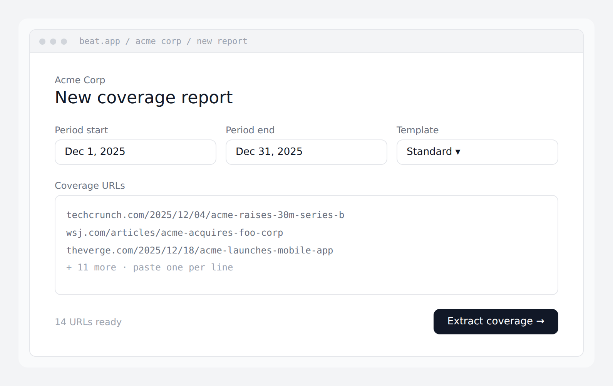
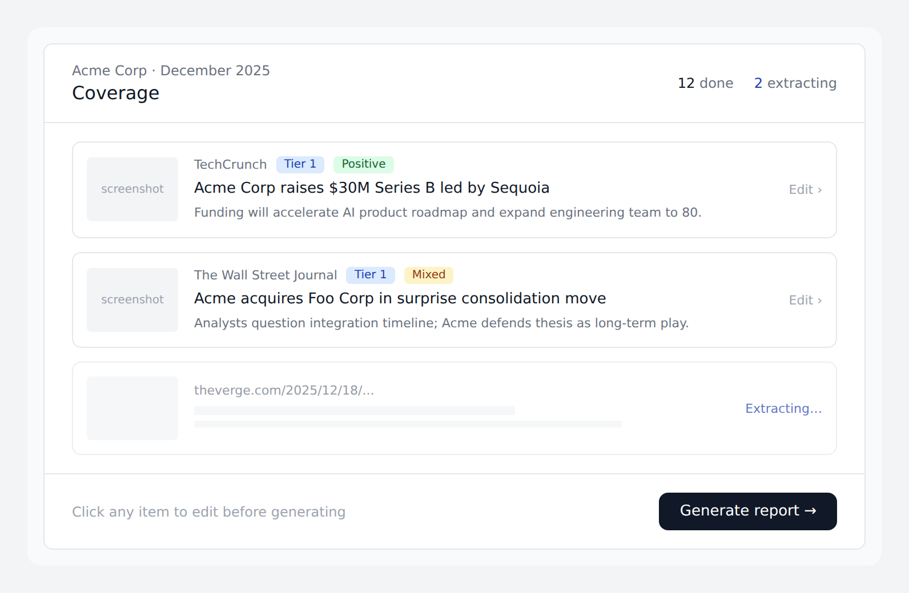
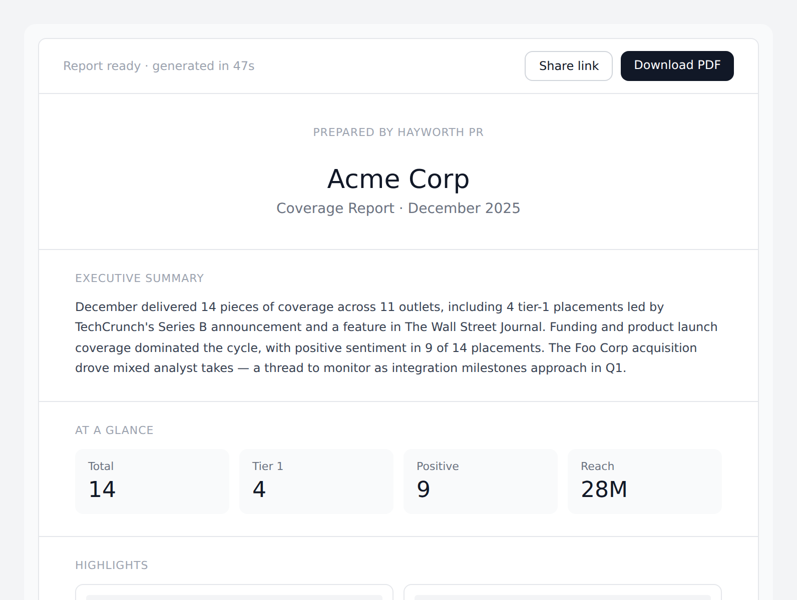

# 07 — Wireframes (core report flow)

The MVP is one job done unreasonably well: turn a list of coverage URLs into a polished, branded PDF report. Three screens carry the entire flow.

These wireframes are not pixel-perfect mocks — they're agreement documents. The information architecture, the transitions, and the priority of elements should match. Visual polish (typography refinement, micro-interactions, empty states, error states) is the frontend dev's job, anchored to a design system established in week 5–6.

## Step 1 — Create report

Behavior:

- Reached from `/clients/:id` via a "New report" button.
- The three top fields prefill where possible: period defaults to "last full month," template defaults to workspace default.
- The URL textarea accepts URLs separated by newlines, commas, or spaces — we normalize on submit.
- Client-side validation: at least 1 URL, period_end ≥ period_start, all URLs are well-formed http(s).
- "Extract coverage →" button triggers `POST /v1/clients/:id/reports` immediately followed by `POST /v1/reports/:id/coverage`. UX-wise these feel like one action; the user sees one transition.

Acceptance criteria:

- User can create a report and submit URLs in under 30 seconds from a cold start.
- Pasting 50 URLs feels instant (no UI freeze).
- Submitting transitions to Step 2 with placeholder cards already on screen.

## Step 2 — Review & edit

Behavior:

- The page is reachable at `/reports/:id` and is the canonical "edit report" surface.
- Cards appear in `queued` state, then transition to `running` (skeleton with URL visible), then to `done` (full content) as the workers process them.
- Frontend polls `GET /v1/reports/:id` every 2 seconds while any item is `queued` or `running`. Stops polling once all items are terminal.
- Failed items show a clear "extraction failed" state with options: Retry, Edit manually, or Remove.
- Clicking any card opens an inline edit drawer: every extracted field is editable. Saving a field marks it `is_user_edited=true` and adds it to `edited_fields` — that field is now sticky.
- Header counts ("12 done, 2 extracting") update live.
- "Generate report →" is disabled until at least one item is `done` and zero are `queued`/`running`.

Acceptance criteria:

- A report with 14 URLs reaches "all done" within 60 seconds end-to-end on the happy path.
- Editing a field and re-running a single-item retry preserves the edit.
- The status header reflects reality without a manual page refresh.

## Step 3 — Generated report

Behavior:

- After clicking "Generate report" in Step 2, the user lands on `/reports/:id/preview` while the report is in `processing` status.
- The preview is a server-rendered HTML version of the same template Puppeteer uses for the PDF — so what the user sees is what the PDF will be.
- "Share link" creates a public token via `POST /v1/reports/:id/share`. Default expiry: 30 days. Copy-to-clipboard on click.
- "Download PDF" is enabled only when `status = 'ready'`. Triggers `GET /v1/reports/:id/pdf`.
- Cover page carries the agency's logo and name. The agency's client (e.g., "Acme Corp") is the headline. Beat is invisible — no Beat logo, no "powered by" footer.
- Executive summary is editable: clicking it opens an inline editor. Saving sets `executive_summary_edited = true` so we don't regenerate it on a re-run.
- "At a glance" stats are computed deterministically from coverage items, not LLM-generated.
- "Highlights" auto-selects the top 4 items by combined tier × prominence × reach. User can swap selections in Phase 2.

Acceptance criteria:

- Time from "Generate report" click to "ready" status: under 30 seconds for a 15-item report.
- Generated PDF passes a manual review: no fabricated quotes, no hyperbole, summary fits the data, branding correct.
- Public share link works in a clean incognito session, expires correctly.

## What's deliberately NOT in these wireframes

These are Phase 2+ surfaces and shouldn't appear in v1:

- Sidebar navigation between multiple clients.
- Activity feed / comments on coverage items.
- A "monitor for new mentions" toggle.
- Pitch tracker columns.
- Multiple template selection during generation (one template, fixed).
- Chart/graph visualizations beyond the four "at a glance" tiles.
- An onboarding flow (we'll bolt one on in week 9).

If the v1 build feels incomplete because of these omissions, that's the point — we're shipping the wedge. Everything else is roadmap.

## Source material

The wireframes were generated from HTML mockups; the source HTML lives elsewhere and is not part of the repo. If you need to evolve these visuals before the design system is established, edit at the conceptual level (what's on screen, what's prioritized) rather than the pixel level. Pixel-level refinement is a week-5/6 frontend task with a real design system.
