# 12a — Phase 3 addition: Campaign workflow

This doc extends `docs/12-phase-3-pitch-tracker.md`. It adds the campaign workflow: brief → strategy → target list → personalized pitches → send → track → learn.

The campaign workflow integrates tightly with the pitch tracker. Sent pitches become rows in the existing `pitches` table; replies and attribution flow through unchanged. Campaigns are the **front-end orchestration layer** that sits on top of the pitch tracker, not a parallel system.

> **READ THIS BEFORE WRITING CODE.** This spec ships with thirteen wireframes in `assets/wireframe-NN-*.png`. The wireframes are the visual ground truth for every UI surface described below. **You must view each wireframe before implementing the corresponding section** — the prose describes the data and behavior; the wireframes describe the layout, hierarchy, color treatment, and copy. A wireframe disagreeing with the prose means the wireframe is right (it's been reviewed against design constraints the prose doesn't capture). The catalog below maps every UI section in this doc to its wireframe.

## Wireframes catalog

All thirteen wireframes live in `assets/`. View them with the `view` tool before building each surface. Implementations that don't match the wireframes will be rejected at review.

| # | File | Surface | Spec section |
|---|------|---------|--------------|
| 01 | `assets/wireframe-01-brief-intake.png` | Stage 1 — Brief intake (free-form + structured) | §"Stage 1 — Brief intake + strategy generation" |
| 02 | `assets/wireframe-02-strategy-review.png` | Stage 1 — AI-generated strategy document review | §"Stage 1 — Brief intake + strategy generation" |
| 03 | `assets/wireframe-03-target-list.png` | Stage 2 — Ranked journalist target list | §"Stage 2 — Target list generation" |
| 04 | `assets/wireframe-04-pitch-review.png` | Stage 4 — Per-journalist pitch review (one at a time) | §"Stage 4 — Human review + send" |
| 05 | `assets/wireframe-05-overview-grid.png` | Campaign overview during sending — all pitches with status | §"Stage 4 — Human review + send" |
| 06 | `assets/wireframe-06-close-insights.png` | Stage 5 — Post-campaign retrospective | §"Stage 5 — Track + learn" |
| 07 | `assets/wireframe-07-edit-mode.png` | Focused pitch editor with regenerate-with-steering | §"Stage 4 — Human review + send" |
| 08 | `assets/wireframe-08-campaign-list.png` | All campaigns across clients (workspace-wide list) | §"API surface" / `GET /v1/campaigns` |
| 09 | `assets/wireframe-09-reply-thread.png` | Reply thread view with classification + drafted response | §"Stage 5 — Track + learn" |
| 10 | `assets/wireframe-10-journalist-drawer.png` | Slide-in journalist profile from target list | §"Stage 2 — Target list generation" |
| 11 | `assets/wireframe-11-rerank-modal.png` | Confirmation modal when strategy edits invalidate the target list | §"API surface" / `POST /v1/campaigns/:id/targets/regenerate` |
| 12 | `assets/wireframe-12-paused-state.png` | Campaign-paused state (manual pause from overview) | §"Stage 4 — Human review + send" |
| 13 | `assets/wireframe-13-template-picker.png` | Campaign-start picker (blank / past campaign / stock template) | §"API surface" / `POST /v1/campaigns` |

## Phase 3 scope expansion

Adding the campaign workflow expands Phase 3 meaningfully. The original Phase 3 spec (`docs/12-phase-3-pitch-tracker.md`) is roughly 5 months of work. The campaign workflow adds another 8–10 weeks. **Total Phase 3 duration: 7–8 months**, not the 5 originally implied. Plan funding, runway, and customer expectations accordingly.

Within Phase 3, the build order is:

1. Pitch tracker core (data model, manual + BCC + extension capture, reply tracking) — *first*
2. Coverage attribution (LLM-assisted matching) — *concurrent with #1 once data exists*
3. Pitch analytics — *follows #2*
4. Journalist database expansion — *follows #2*
5. **Campaign workflow** (this doc) — *last; depends on all of the above*

The campaign workflow cannot be built first or in parallel — every stage depends on data and infrastructure earlier stages produce.

## What and why

A "campaign" in PR is a coordinated outreach effort tied to a news moment: product launch, funding round, executive announcement, thought-leadership push. The workflow is universally familiar:

1. Write a brief describing what's being announced and the goals.
2. Develop a strategy: angles, audiences, hooks, timing.
3. Build a target media list — which journalists to contact.
4. Draft personalized pitches.
5. Send pitches; manage replies; track coverage.
6. Retro: what worked, what didn't.

Today this happens in spreadsheets, email drafts folders, and senior practitioners' heads. The pitch tracker (Phase 3 core) handles steps 5–6 well. The campaign workflow extends to handle 1–4 — the strategic and creative work — with AI acceleration that respects human judgment.

### Why now (Phase 3, not earlier)

The campaign workflow needs:
- A populated `authors` database (Phase 1 + Phase 3 coverage ingest)
- Recent-articles enrichment per author (Phase 3)
- Per-author response-rate signals (Phase 3 reply tracking)
- Pitch→coverage attribution data (Phase 3)
- Per-workspace pitch history (Phase 3)
- Cross-customer aggregate patterns (Phase 3, with Phase 1.5 social mentions extending the dataset)

Without these, the AI ranking and pitch drafting would be cold-starting on every dimension. By Phase 3 month 5, the data exists.

### Why not Phase 4

Phase 4 is enterprise + monitoring + integrations. Campaigns are a core agency workflow, not an enterprise add-on. Slotting them into Phase 4 would mean shipping the agency's most-needed feature behind enterprise pricing, which inverts the wedge logic.

## Critical guardrail: human-in-the-loop, always

**Pitches never send automatically.** Every individual pitch requires a human click on a "Send" button before it leaves Beat. There is no auto-send mode, no scheduled bulk-send, no "approve and forget" workflow. Configurability on this is **deliberately not exposed** — the simplest possible model is the safest.

The reasoning, briefly:

- The cost of one wrong auto-sent pitch (sent to the wrong journalist, with the wrong client name, with a hallucinated quote) is potentially permanent damage to a relationship.
- The cost of a human click is ~2 seconds. Across 50 pitches in a campaign, that's a few minutes of friction — well below the time saved by AI drafting.
- An "approve and send all" button looks similar but introduces a class of failure modes (a single bad pitch in the batch goes out unchecked) that the always-individual click pattern eliminates.

If, in a later phase, customer demand for higher-volume sending becomes loud and the data shows we can ship safe guardrails, we'll revisit. Not before.

This guardrail belongs in `CLAUDE.md`'s critical guardrails list as well. See "CLAUDE.md routing update" at the end of this doc.

## Architecture overview

```
┌─────────────────┐      ┌──────────────────┐      ┌─────────────────┐
│ Campaign Brief  │  →   │ Strategy Doc     │  →   │ Target List     │
│ (user input)    │      │ (Opus generates) │      │ (Sonnet ranks)  │
└─────────────────┘      └──────────────────┘      └────────┬────────┘
                                                            │
                                                            ▼
                         ┌─────────────────────────────────────────┐
                         │  Per-target pitch drafts (Opus)         │
                         │  grounded in journalist's recent work   │
                         └────────────────┬────────────────────────┘
                                          │
                                          ▼
                         ┌─────────────────────────────────────────┐
                         │  Human review (mandatory) — one pitch   │
                         │  at a time. Edit, regen, skip, send.    │
                         └────────────────┬────────────────────────┘
                                          │
                                          ▼
                         ┌─────────────────────────────────────────┐
                         │  Send (Beat-sent or mailto:, user picks)│
                         │  Becomes a row in `pitches` table       │
                         └────────────────┬────────────────────────┘
                                          │
                                          ▼
                         ┌─────────────────────────────────────────┐
                         │  Phase 3 mechanics: reply tracking,     │
                         │  attribution, analytics                 │
                         └────────────────┬────────────────────────┘
                                          │
                                          ▼
                         ┌─────────────────────────────────────────┐
                         │  Campaign retro: outcomes inform        │
                         │  insights + future ranking              │
                         └─────────────────────────────────────────┘
```

The pipeline is built around five distinct AI calls. Each call produces editable output. The agency stays in control at every step; the AI accelerates without making decisions.

## The five stages

### Stage 1 — Brief intake + strategy generation

> **Wireframes for this section:**
> - Brief intake → `assets/wireframe-01-brief-intake.png` — view this before building the brief input form
> - Strategy review → `assets/wireframe-02-strategy-review.png` — view this before building the strategy review surface
> - Template picker (entry point to this stage) → `assets/wireframe-13-template-picker.png` — view this before building the campaign-start flow

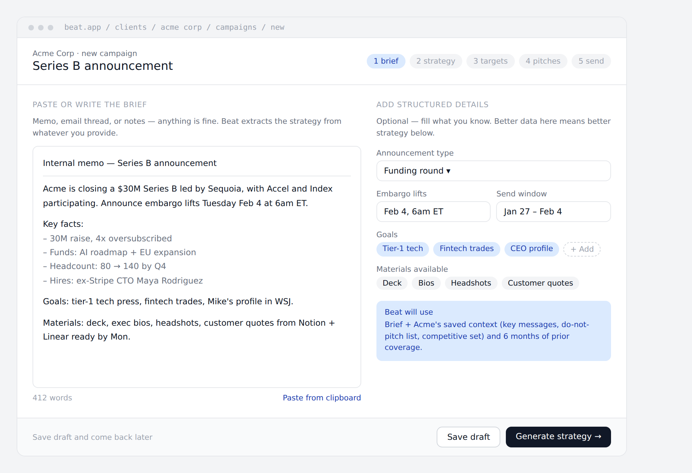

The agency provides a brief. Three input modes:

1. **Free-form text.** Paste a memo, an email thread, a Google Doc — whatever exists. Most realistic option.
2. **Structured form.** Guided fields: announcement type, key facts, dates, materials, goals, constraints. Better data, more friction.
3. **Hybrid.** Paste free-form, then fill structured fields where data is missing. Best of both.

Whatever the input, the system extracts and generates a **campaign strategy document** with:

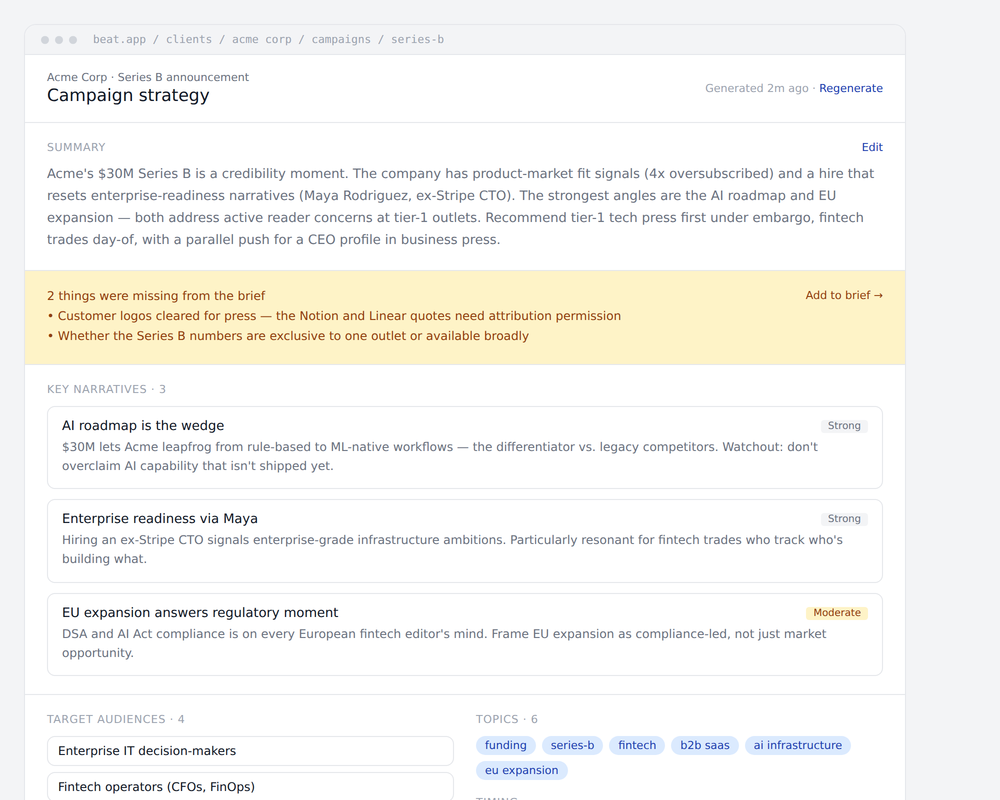

- **Key narratives** — the 2–4 storylines this campaign supports.
- **Target audiences** — who needs to read it (segmented).
- **Industries / topics** — beat tags relevant to the story.
- **News hooks** — why this matters now (competitive context, regulatory moments, trending topics, anniversaries, data points).
- **Angles per audience** — different framings for different reader types.
- **Suggested timing** — embargo strategy, day-of-week recommendation, sequencing across audiences.
- **Risks and considerations** — what could go wrong; sensitive context the AI noticed.

The output is readable prose plus structured data (the prose for humans to review and edit; the structured data drives ranking and pitch generation downstream). The agency can edit any section. Strategy edits trigger downstream re-runs of ranking and drafting (with explicit confirmation, so the user doesn't accidentally invalidate hours of editing).

### Stage 2 — Target list generation

> **Wireframes for this section:**
> - Target list → `assets/wireframe-03-target-list.png` — view this before building the ranked-list surface
> - Journalist profile drawer (slide-in from target list) → `assets/wireframe-10-journalist-drawer.png` — view this before building the inline profile drawer
> - Re-rank confirmation modal → `assets/wireframe-11-rerank-modal.png` — view this before building the strategy-edit-invalidates-targets flow

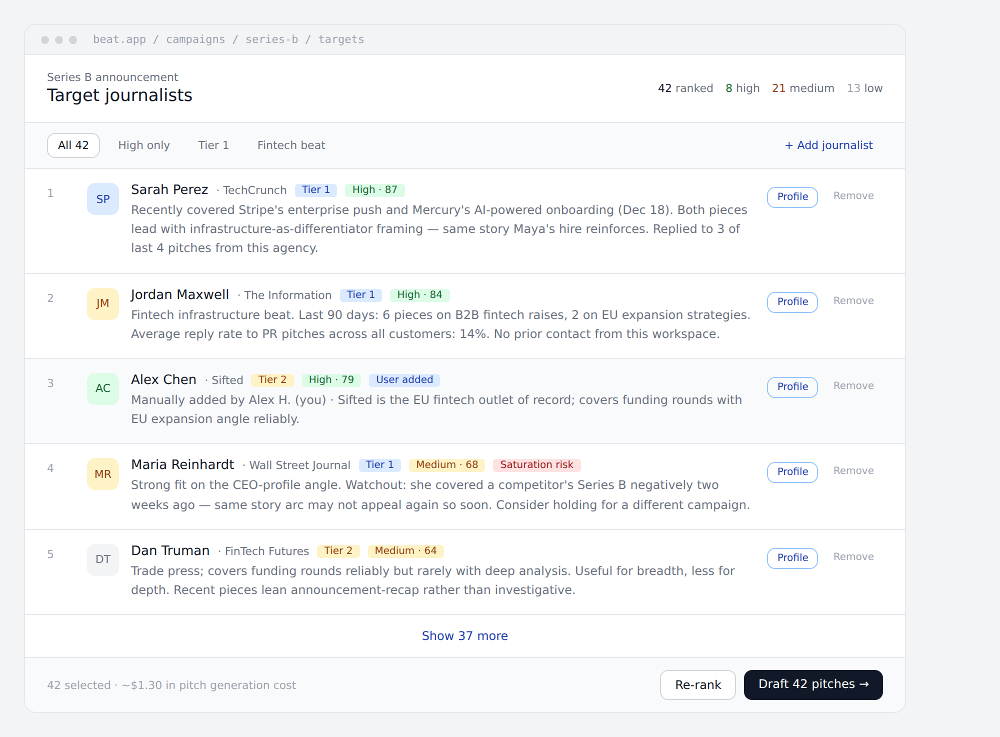

Given the strategy, the system ranks journalists from `authors` by likelihood to cover. Multi-signal score:

- **Topic alignment** — do their recent bylines match the strategy's topics and industries?
- **Beat fit** — do their stated/inferred beats align? (The `preferred_topics` field from Phase 3.)
- **Audience reach** — do they write for outlets matching the target audiences?
- **Recency** — have they written about adjacent stories recently?
- **Historical responsiveness** — do they reply to pitches generally? To this agency specifically? (Per-author and per-workspace signals from Phase 3 reply tracking.)
- **Past coverage of this client** — covered them positively? More likely to again. Negatively? Skip. Multiple times recently? Probably saturated.
- **Coverage exhaustion** — has this journalist already covered the same angle this week?
- **Outlet tier preferences** — the brief specifies target outlet tier mix.

Output: a ranked list with **confidence labels** (`high`/`medium`/`low`/`exploratory`) and a **"why they matter"** rationale per journalist — 2–3 sentences grounded in their actual recent bylines.

The agency can:

- Add a journalist who isn't on the list.
- Remove a journalist.
- Reorder by their own judgment.
- See the full journalist profile (Phase 3 §12.6) inline before committing.

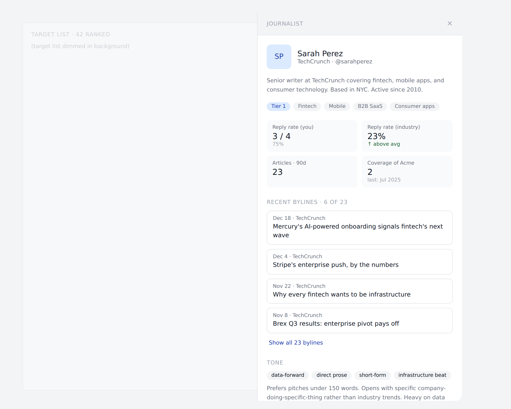

- Set a target list size (e.g., "top 25" or "top 75" or "all with score ≥ 60").

The ranking is rerunnable — strategy edits trigger a re-rank with confirmation.

### Stage 3 — Personalized pitch drafting

For each target journalist, generate a personalized pitch grounded in:

- The campaign strategy.
- The journalist's recent articles (last 90 days, summarized).
- The journalist's tone and structure preferences (inferred from past pieces — see `pitch-tone-analysis-v1` prompt below).
- Past successful pitches to that journalist from this workspace (if any).
- Aggregate patterns across customers ("journalists at this outlet typically respond to pitches under 200 words" — anonymized).
- Client style notes from `client_context`.
- Optional agency-specific signature/template.

The generated pitch includes:

- Subject line + 2 alternates.
- Body.
- Suggested follow-up timing.
- A **"why this for this journalist"** rationale visible to the user, never to the journalist.
- Confidence label (some pitches will be weaker than others — surface that honestly).

### Stage 4 — Human review + send

> **Wireframes for this section (most-built-against group):**
> - Pitch review (one at a time, full context) → `assets/wireframe-04-pitch-review.png` — primary surface, view this first
> - Edit mode (focused editor with steering) → `assets/wireframe-07-edit-mode.png` — view this before building the edit surface
> - Campaign overview during sending → `assets/wireframe-05-overview-grid.png` — view this before building the all-pitches grid
> - Paused state → `assets/wireframe-12-paused-state.png` — view this before building the manual-pause flow

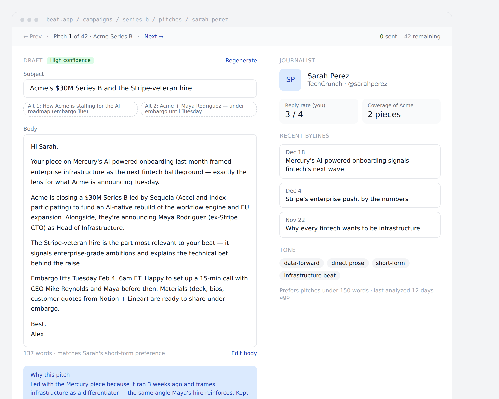

A focused review surface — one journalist at a time — with their full profile and recent articles visible alongside the pitch. The user can:

- **Edit** subject and body inline.

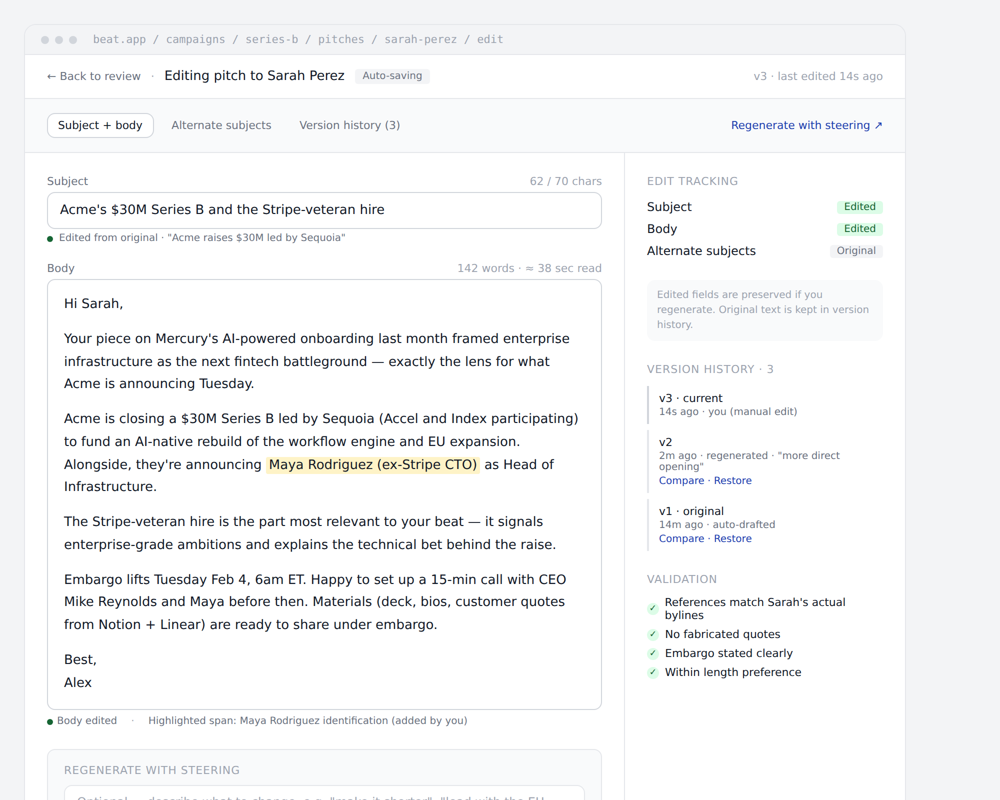

- **Regenerate** (with optional steering: "make it shorter," "more curious tone," "lead with the data point").
- **Skip** (with optional reason captured for learning).
- **Send** — explicit click per pitch.

Two send modes, chosen per pitch:

- **Beat-sent.** Pitch goes via Beat's transactional infrastructure. Full tracking — opens, replies routed back through threading, all the Phase 3 mechanics. Lower deliverability than personal email; cost: the journalist sees `agency-name@send.beat.app` (or workspace-configured custom domain) as the sender.
- **mailto:.** Opens the user's email client with the pitch pre-filled. The user reviews and clicks send in their own email client. Captured back via the BCC capture or browser extension from Phase 3 §12.2. Higher deliverability; some tracking fidelity loss (no open tracking, replies need explicit forwarding setup).

The user picks per pitch. A workspace-level default exists ("default to mailto:" or "default to Beat-sent") but the user always sees both options on the review surface.

The system enforces strict pacing: even Beat-sent pitches go out at 30 sends/hour per workspace, with smart spacing within that hour to avoid sending bursts that look like spam to email providers. mailto: sends bypass the rate limit since the user sends from their own infrastructure (but the BCC capture still pages them in for tracking).

A campaign-level overview grid lets the user scan all pitches with their statuses (replied / awaiting / drafted / skipped / OOO) without losing the per-pitch review discipline:

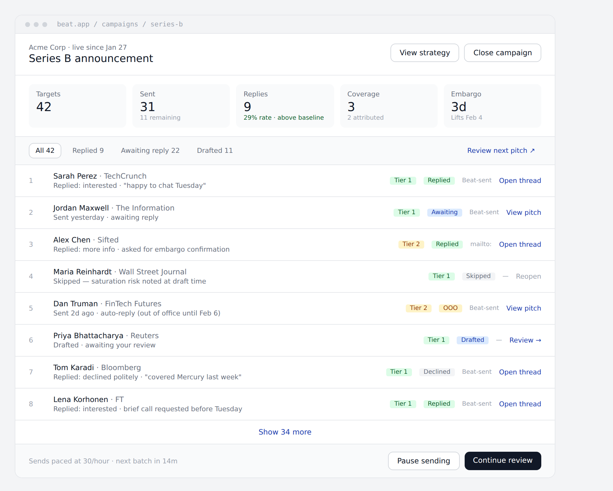

The user can pause sending at any time — useful when news timing changes or reply quality on early pitches suggests adjusting the angle:

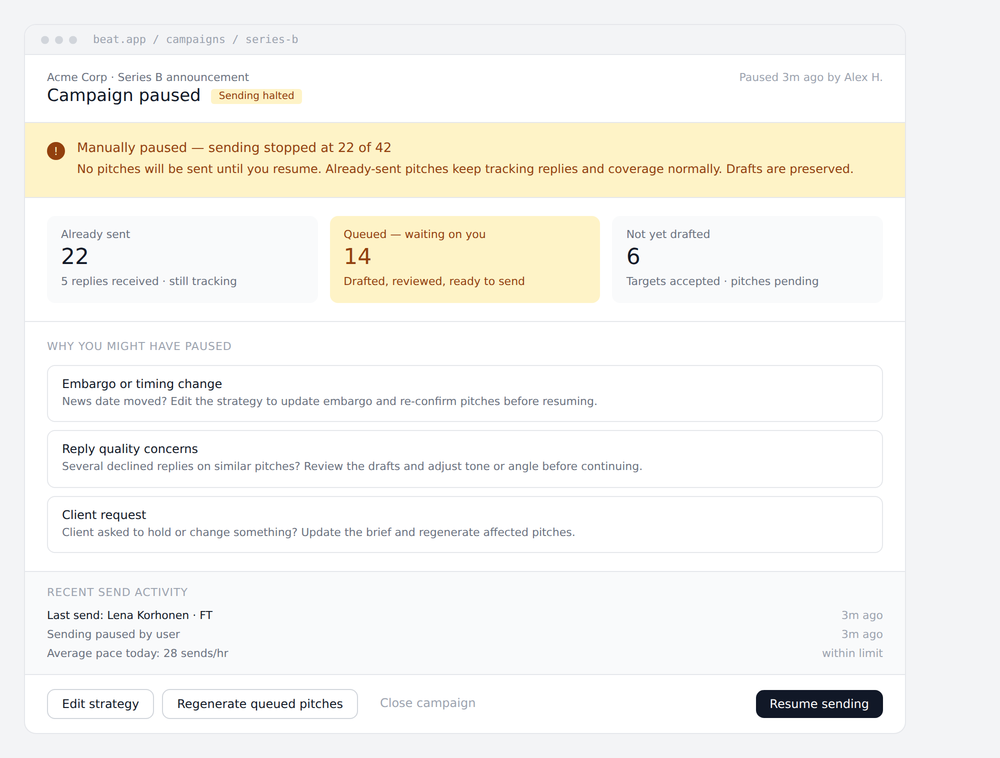

### Stage 5 — Track + learn

### Stage 5 — Track + learn

> **Wireframes for this section:**
> - Reply thread (managing journalist replies during the campaign) → `assets/wireframe-09-reply-thread.png` — view this before building the reply view
> - Close + insights (post-campaign retrospective) → `assets/wireframe-06-close-insights.png` — view this before building the retrospective surface

Sent pitches become rows in the existing `pitches` table from `docs/12-phase-3-pitch-tracker.md` §12.1. The `campaign_id` field on `pitches` ties them back to the campaign. From this point, all Phase 3 mechanics work unchanged:

- Reply tracking via thread matching.
- Reply classification (`prompts/reply-classification-v1.md`).
- Coverage attribution (`prompts/pitch-attribution-v1.md`).
- Pitch analytics rolled up.

When a journalist replies, the user manages the conversation through a dedicated reply view that shows the classification, the suggested next-action drafted reply, and the campaign context:

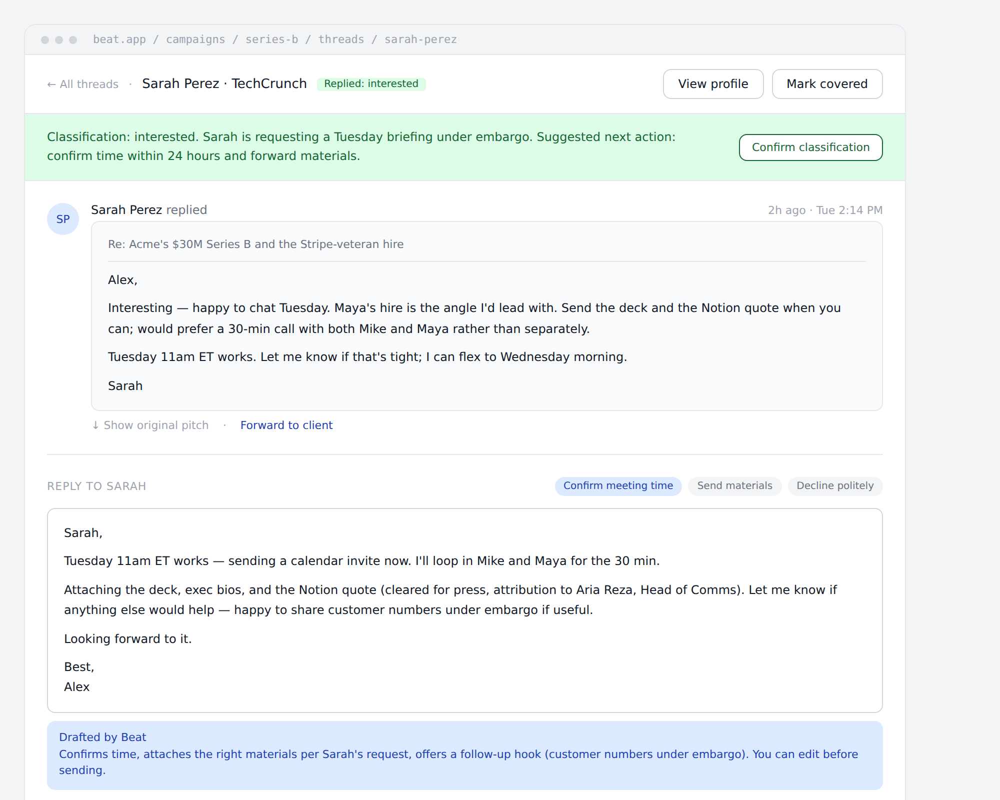

The campaign closes (manually or automatically based on send-window end + a 30-day reply window). At close, the system generates **campaign insights**:

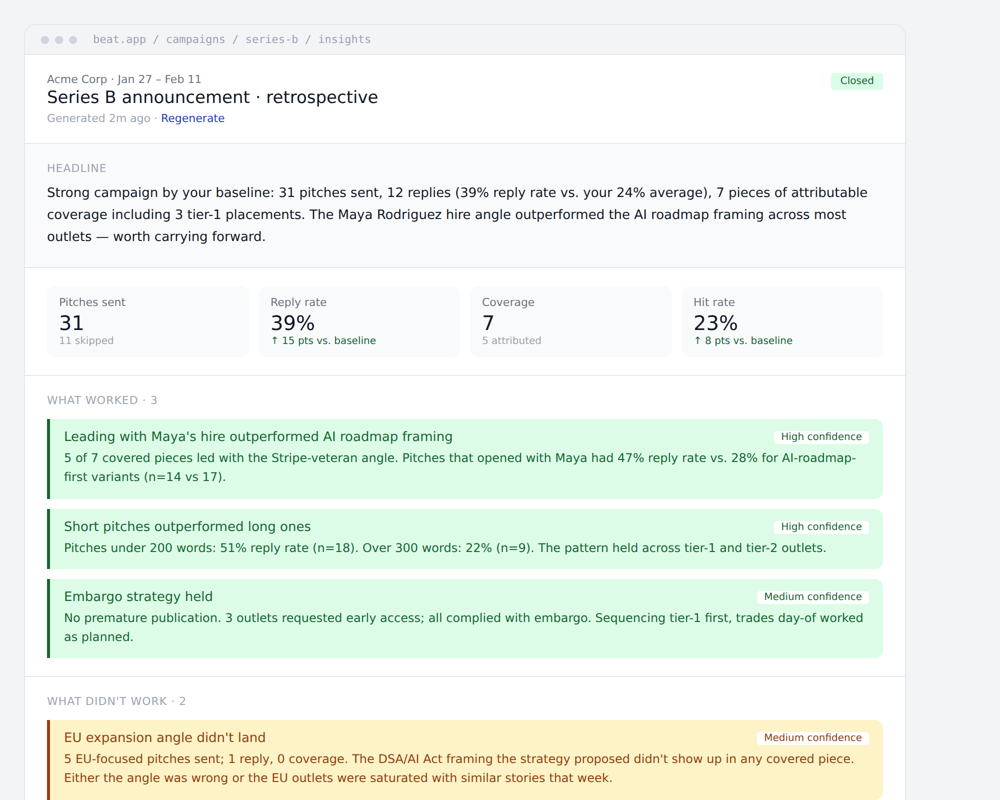

- Reply rate vs. workspace baseline.
- Coverage hit rate vs. workspace baseline.
- Top-performing pitches by subject pattern, length, opening style.
- Per-journalist outcomes ranked by responsiveness.
- "What we learned about this client's news" — patterns specific to this campaign that might inform the next.

These insights are exposed to the user as **readable analysis**, not just charts. They feed back into:

- **Per-journalist scoring updates.** Sarah Perez replied to 3 of 4 pitches → strong positive signal next time.
- **Per-workspace pattern learning.** Pitches under 200 words got 23% reply rate; over 300, 8% → surfaces as a recommendation in the next pitch review.
- **Cross-customer aggregate patterns.** Some signals hold across all customers; feed the global ranking model.

The learning is **transparent**: users see the patterns the system identified. Nothing happens silently in the background.

## Data model

### `campaigns` table

```sql
CREATE TABLE campaigns (
    id              UUID PRIMARY KEY DEFAULT gen_random_uuid(),
    workspace_id    UUID NOT NULL REFERENCES workspaces(id) ON DELETE CASCADE,
    client_id       UUID NOT NULL REFERENCES clients(id) ON DELETE CASCADE,
    name            TEXT NOT NULL,
    status          TEXT NOT NULL DEFAULT 'draft' CHECK (status IN (
      'draft','strategy_review','targeting','drafting','reviewing','sending','live','closed','archived'
    )),
    -- Brief (Stage 1 input)
    brief_text      TEXT,                          -- free-form input
    brief_structured JSONB NOT NULL DEFAULT '{}'::jsonb,
        -- e.g. { announcement_type, key_facts[], embargo_at, materials[], goals[], constraints[] }
    -- Strategy (Stage 1 output)
    strategy_text   TEXT,                          -- prose strategy document
    strategy_structured JSONB NOT NULL DEFAULT '{}'::jsonb,
        -- { key_narratives[], target_audiences[], topics[], news_hooks[], angles_per_audience[], timing }
    strategy_prompt_version TEXT,
    strategy_generated_at TIMESTAMPTZ,
    strategy_edited_at TIMESTAMPTZ,
    -- Timing
    send_window_start TIMESTAMPTZ,
    send_window_end   TIMESTAMPTZ,
    embargo_at        TIMESTAMPTZ,
    -- Outcomes (denormalized; updated when campaign closes)
    final_targets_count INT,
    final_pitches_sent  INT,
    final_replies_count INT,
    final_coverage_count INT,
    closed_at       TIMESTAMPTZ,
    insights_text   TEXT,                          -- generated retro analysis
    insights_generated_at TIMESTAMPTZ,
    -- Metadata
    created_by_user_id UUID NOT NULL REFERENCES users(id) ON DELETE SET NULL,
    created_at      TIMESTAMPTZ NOT NULL DEFAULT now(),
    updated_at      TIMESTAMPTZ NOT NULL DEFAULT now(),
    deleted_at      TIMESTAMPTZ
);

CREATE INDEX idx_campaigns_workspace_status ON campaigns(workspace_id, status);
CREATE INDEX idx_campaigns_client_recent ON campaigns(client_id, created_at DESC);
```

### `campaign_targets` table

```sql
CREATE TABLE campaign_targets (
    id              UUID PRIMARY KEY DEFAULT gen_random_uuid(),
    campaign_id     UUID NOT NULL REFERENCES campaigns(id) ON DELETE CASCADE,
    workspace_id    UUID NOT NULL REFERENCES workspaces(id) ON DELETE CASCADE,
    author_id       UUID NOT NULL REFERENCES authors(id) ON DELETE CASCADE,
    -- Ranking output
    rank            INT,                            -- 1-indexed; NULL if user-added off-list
    score           NUMERIC(5,2),                   -- 0–100 composite; NULL if user-added
    confidence      TEXT CHECK (confidence IN ('high','medium','low','exploratory','user_added')),
    why_they_matter TEXT,                           -- 2–3 sentence rationale
    score_breakdown JSONB NOT NULL DEFAULT '{}'::jsonb,
        -- per-signal contribution: { topic_alignment, beat_fit, recency, responsiveness, ... }
    ranking_prompt_version TEXT,
    -- Status
    status          TEXT NOT NULL DEFAULT 'ranked' CHECK (status IN (
      'ranked','accepted','removed','manually_added'
    )),
    removed_reason  TEXT,                           -- captured if removed; useful for learning
    -- Snapshot at ranking time (so re-ranking later doesn't change historical context)
    journalist_snapshot JSONB NOT NULL DEFAULT '{}'::jsonb,
        -- recent articles, beats, follower count, etc. at ranking time
    created_at      TIMESTAMPTZ NOT NULL DEFAULT now(),
    updated_at      TIMESTAMPTZ NOT NULL DEFAULT now(),
    UNIQUE (campaign_id, author_id)
);

CREATE INDEX idx_campaign_targets_campaign_rank ON campaign_targets(campaign_id, rank);
CREATE INDEX idx_campaign_targets_status ON campaign_targets(campaign_id, status);
```

### `campaign_pitches` table

```sql
CREATE TABLE campaign_pitches (
    id              UUID PRIMARY KEY DEFAULT gen_random_uuid(),
    campaign_id     UUID NOT NULL REFERENCES campaigns(id) ON DELETE CASCADE,
    campaign_target_id UUID NOT NULL UNIQUE REFERENCES campaign_targets(id) ON DELETE CASCADE,
    workspace_id    UUID NOT NULL REFERENCES workspaces(id) ON DELETE CASCADE,
    -- Generated content
    subject         TEXT,
    body            TEXT,
    alternate_subjects TEXT[] NOT NULL DEFAULT '{}',
    -- Metadata about the generation
    confidence      TEXT CHECK (confidence IN ('high','medium','low')),
    why_this_pitch  TEXT,                           -- rationale visible to user only
    suggested_followup_at TIMESTAMPTZ,
    drafting_prompt_version TEXT,
    drafted_at      TIMESTAMPTZ,
    -- Edit tracking (mirrors the is_user_edited pattern from coverage extraction)
    is_user_edited  BOOLEAN NOT NULL DEFAULT false,
    edited_fields   TEXT[] NOT NULL DEFAULT '{}', -- e.g., ['subject', 'body']
    last_edited_at  TIMESTAMPTZ,
    last_edited_by_user_id UUID REFERENCES users(id) ON DELETE SET NULL,
    -- Workflow status
    draft_status    TEXT NOT NULL DEFAULT 'drafting' CHECK (draft_status IN (
      'drafting','drafted','edited','approved','sent','skipped','failed'
    )),
    skipped_reason  TEXT,
    -- Send mechanics
    send_method     TEXT CHECK (send_method IN ('beat_sent','mailto')),
    sent_at         TIMESTAMPTZ,
    sent_by_user_id UUID REFERENCES users(id) ON DELETE SET NULL,
    -- Linkage to the canonical pitch row once sent
    pitch_id        UUID UNIQUE REFERENCES pitches(id) ON DELETE SET NULL,
    -- Audit trail of regenerations (kept for learning)
    regeneration_count INT NOT NULL DEFAULT 0,
    regeneration_history JSONB NOT NULL DEFAULT '[]'::jsonb,
        -- [{at, prompt_version, steering_note, prior_subject_hash, prior_body_hash}, ...]
    created_at      TIMESTAMPTZ NOT NULL DEFAULT now(),
    updated_at      TIMESTAMPTZ NOT NULL DEFAULT now()
);

CREATE INDEX idx_campaign_pitches_campaign_status ON campaign_pitches(campaign_id, draft_status);
CREATE INDEX idx_campaign_pitches_pitch ON campaign_pitches(pitch_id) WHERE pitch_id IS NOT NULL;
```

### Augmentations to existing Phase 3 tables

`pitches` (from `docs/12-phase-3-pitch-tracker.md` §12.1) gets a new column:

```sql
ALTER TABLE pitches ADD COLUMN campaign_id UUID REFERENCES campaigns(id) ON DELETE SET NULL;
CREATE INDEX idx_pitches_campaign ON pitches(campaign_id) WHERE campaign_id IS NOT NULL;
```

`pitches.source` gets a new allowed value: `'campaign'` (in addition to the existing `manual`, `gmail_addon`, `outlook_addon`, `browser_extension`, `imported`).

### Why some fields exist

- **`journalist_snapshot` on targets.** The journalist database changes constantly — new bylines, beat shifts, follower count drift. A campaign sent in March should show why the AI ranked Sarah Perez highly *as of March*, not as of whenever the page is reloaded. Snapshotting protects historical truthfulness.
- **`regeneration_history` on pitches.** Every regeneration captures what the user steered toward and what changed. This becomes training signal: across thousands of regenerations we'll see which steering notes correlate with sent-vs-skipped outcomes.
- **`is_user_edited` + `edited_fields`** mirror the same pattern from coverage extraction. The discipline: re-runs respect user edits.

### What's not in the data model

- **No `confidence_threshold_for_auto_send` column.** Auto-send doesn't exist; the column would be misleading.
- **No campaign templates.** Every campaign starts from a fresh brief in v1. Templates ("our standard product launch flow") are a Phase 4 enhancement.
- **No multi-stage approval on campaigns.** Within a workspace, anyone with `member` role can send. The Phase 2 portal client-approval pattern doesn't apply here — pitches go to journalists, not to clients.

## API surface

### Campaign CRUD

- `POST /v1/campaigns` — body: `{ client_id, name, brief_text?, brief_structured?, template_id? }`. Creates draft. The `template_id` field is optional and ties to either a past campaign or a stock template — see the template picker UI below for which entry points produce which body shape.

  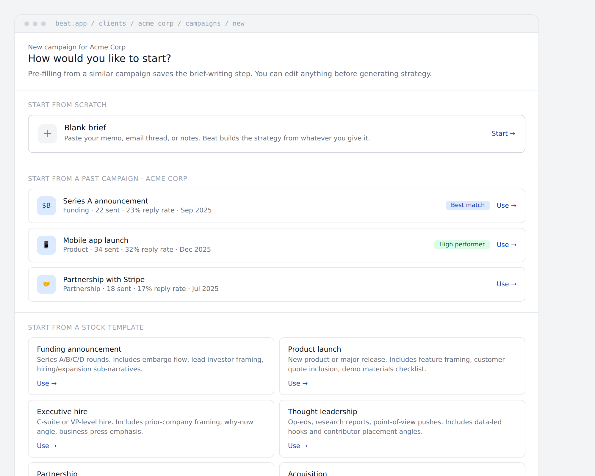

- `GET /v1/campaigns` — list, filterable by client, status. **The workspace-wide campaign list is rendered against this endpoint:**

  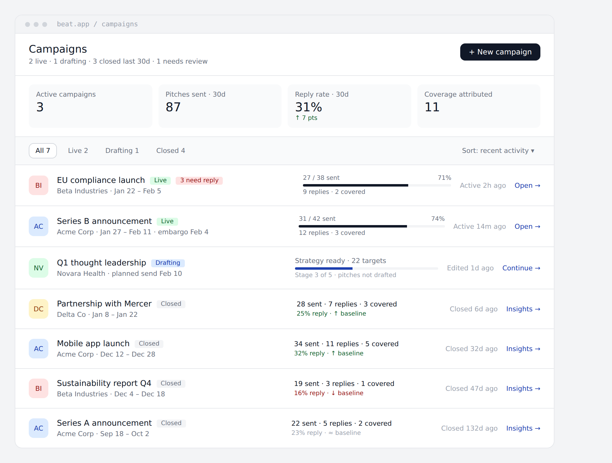

- `GET /v1/campaigns/:id` — full detail with strategy + targets + pitches.
- `PATCH /v1/campaigns/:id` — update name, brief, send window.
- `DELETE /v1/campaigns/:id` — soft delete (cascades to targets and unsent pitches; sent pitches remain in `pitches` table without campaign linkage).

### Stage transitions

Each stage has an explicit transition endpoint that runs the AI work:

- `POST /v1/campaigns/:id/generate-strategy` — runs `campaign-strategy-v1`. Async. Webhook or poll for completion. Updates `campaigns.strategy_text` + `strategy_structured`.
- `POST /v1/campaigns/:id/generate-targets` — runs `journalist-ranking-v1` against the candidate pool. Async (potentially many calls). Returns targets in batches.
- `POST /v1/campaigns/:id/generate-pitches` — runs `pitch-draft-v1` for each accepted target. Async. One pitch per target.
- `POST /v1/campaigns/:id/close` — moves campaign to `closed`. Triggers `campaign-insights-v1`.

### Strategy editing

- `PATCH /v1/campaigns/:id/strategy` — body: `{ strategy_text?, strategy_structured? }`. Updates strategy directly. If structured fields change, mark stale-flags on downstream targets and pitches (UI surfaces "your strategy changed; re-run ranking?" prompt).

### Target list operations

- `GET /v1/campaigns/:id/targets` — paginated list of ranked targets with profile snippets.
- `POST /v1/campaigns/:id/targets` — body: `{ author_id }`. Manually add a journalist (sets `status='manually_added'`, `confidence='user_added'`).
- `PATCH /v1/campaigns/:id/targets/:target_id` — accept, remove (with optional reason), reorder.
- `POST /v1/campaigns/:id/targets/regenerate` — re-rank from scratch using current strategy. Confirms with user; preserves user-added entries. **The confirmation modal is the gate that prevents accidental re-ranks after strategy edits:**

  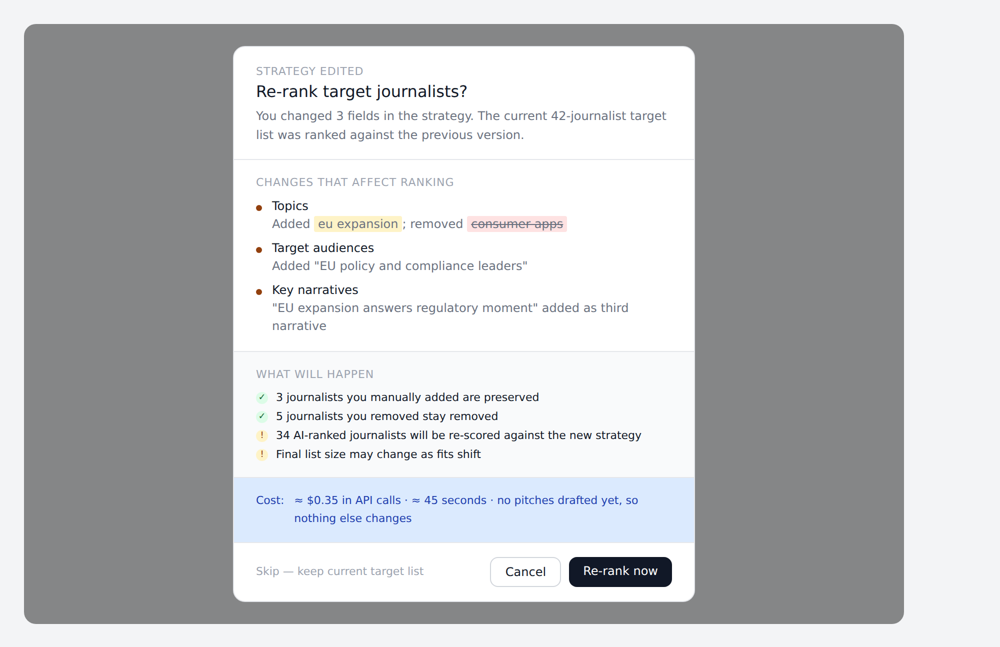

### Pitch operations

- `GET /v1/campaigns/:id/pitches` — list with status filter.
- `GET /v1/campaigns/:id/pitches/:pitch_id` — full pitch with journalist context for the review surface.
- `PATCH /v1/campaigns/:id/pitches/:pitch_id` — edit subject, body. Sets `is_user_edited=true` on touched fields.
- `POST /v1/campaigns/:id/pitches/:pitch_id/regenerate` — body: `{ steering_note? }`. Re-runs draft with optional steering.
- `POST /v1/campaigns/:id/pitches/:pitch_id/skip` — body: `{ reason? }`. Marks skipped.
- `POST /v1/campaigns/:id/pitches/:pitch_id/send` — body: `{ send_method }`. Validates send_method, then either:
  - `beat_sent`: enqueues for transactional send via Beat's email infrastructure. Subject to 30/hour rate limit.
  - `mailto`: returns a `mailto:` URL with subject and body URL-encoded; client opens user's email composer. The pitch is marked `sent` optimistically; the BCC capture from Phase 3 reconciles with the actual sent email.

### Insights

- `GET /v1/campaigns/:id/insights` — generated retro analysis once `closed`.
- `POST /v1/campaigns/:id/insights/regenerate` — re-run insights with refreshed data.

### Rate limiting (specific to campaigns)

- `POST /v1/campaigns/:id/pitches/:pitch_id/send` with `send_method=beat_sent`: 30/hour per workspace, with smart spacing.
- `POST /v1/campaigns/:id/generate-targets`: 5/hour per workspace (the LLM-heavy step).
- `POST /v1/campaigns/:id/pitches/:pitch_id/regenerate`: 60/hour per workspace, 10/hour per pitch.

## The five new prompts

All follow the prompt versioning conventions in `docs/05-llm-prompts.md`. Files live in `prompts/` alongside the existing ones.

### 1. `campaign-strategy-v1.md` (Opus)

Highest-stakes prompt in the feature. Brief → strategy document. The full prompt file is included in this package.

### 2. `journalist-ranking-v1.md` (Sonnet)

Per-candidate scoring. Run once per candidate journalist; could be hundreds of calls per campaign. Sonnet because volume + cost; the ranking task is well-suited to Sonnet's strengths.

### 3. `pitch-tone-analysis-v1.md` (Sonnet)

Journalist's recent articles → tone descriptor. Cached per author, refreshed monthly. Used as input by the pitch drafting prompt. Separated from drafting so we can refresh tone analysis on a slower cadence than pitch generation.

### 4. `pitch-draft-v1.md` (Opus)

The personalized pitch generator. Opus because pitch quality is what the journalist sees first and judges. One call per target.

### 5. `campaign-insights-v1.md` (Sonnet)

Campaign outcomes → readable analysis. Sonnet is fine; this is post-hoc reporting, not customer-facing prose.

The five prompt files are in `prompts/` in this package.

## Critical risks (extended)

The Phase 3 spec already covers risks for the pitch tracker. Additional risks specific to the campaign workflow:

### 1. Hallucinated journalist details

The single worst failure mode. If a pitch confidently says "I noticed your recent piece on quantum cryptography" but the journalist has never written about quantum cryptography, the pitch is worse than no pitch — it's evidence the agency doesn't know what they're talking about.

Mitigations baked into the prompts:

- The drafting prompt requires every claim about the journalist's work to reference an article URL it was given. The prompt is told to refuse to generate claims it can't ground.
- The eval set explicitly tests for "AI generates plausible-but-false claims about a journalist's coverage." Hard gate: zero hallucinations on the fact-grounding eval.
- Journalist snapshots include the actual article titles + summaries, not just metadata; the prompt has the source material in front of it.

### 2. Ranking model cold start

Without months of data, per-workspace ranking signals are weak. Aggregate cross-customer signals fill the gap, but with selection bias (we only see what *our* customers pitch and track).

Mitigations:

- The ranking output explicitly surfaces "low confidence" labels and explains why. Users see that the model is uncertain and can override.
- The first 10 campaigns in a new workspace surface a banner: "Your personalized signal is just getting started — expect ranking quality to improve over time."
- Manual override is prominently available; the system never forces the user to send to its top picks.

### 3. Pitch personalization that crosses into creepy

"I noticed you went to Sarah Lawrence and your dog's name is Pepper" is the wrong pitch. Personalization must be grounded in *professional* signals — recent bylines, beat coverage, stated topical interests — not personal life.

Mitigations:

- The drafting prompt explicitly prohibits non-professional personalization.
- Eval set includes adversarial cases: "If the journalist's bio mentions a dog's name, the generated pitch must NOT mention it."
- The journalist snapshot fed to the prompt is filtered to professional fields only; personal-tone fields aren't passed through.

### 4. Gaming the ranking

Once journalists realize they're being algorithmically ranked, some will optimize their public profiles to game it. We accept this and stay transparent: the signals (recent work, beat alignment, response history) are what they appear to be. We don't add hidden multipliers that we'd hate to defend.

### 5. Privacy — opted-out journalists

Phase 3's `beat.app/journalist-optout` flow removes journalists from search and pitching. The campaign workflow must hard-filter opt-outs from ranking *before* the LLM ever sees them.

Implementation: the candidate pool query for ranking includes `WHERE deleted_at IS NULL` (deleted_at is set on opt-out). The ranking worker double-checks each candidate for opt-out at request time — defense in depth.

### 6. Pitch volume escalation

The friction reduction is real — agencies could go from 20 pitches per campaign to 200 because it's cheaper now. That tilts the ecosystem toward spam.

Mitigations:

- Confidence labels are prominent; users see when the system is uncertain.
- Per-campaign volume warnings: "You're sending 150 pitches in this campaign. Average reply rate at this volume is N%, vs. M% for campaigns under 50 pitches. Consider tightening your target list."
- Send rate limiting: 30/hour even Beat-sent. Forces pacing across hours/days.
- Skipped-pitch tracking: if a workspace skips >40% of generated pitches, surface it ("you're frequently skipping low-confidence pitches; consider raising the score threshold to save AI cost").

### 7. Sender reputation (Beat-sent mode)

Beat-sent emails go from `agency-name@send.beat.app` (or workspace-configured custom domain). One workspace's bad sending behavior could damage deliverability for all workspaces.

Mitigations:

- Per-workspace sub-domains where possible (`hayworth-pr.send.beat.app`).
- Aggressive bounce/complaint handling: 5 hard bounces in a week pauses sending and notifies the workspace owner.
- Sender warm-up for new workspaces — first 50 sends are throttled to 5/day, ramping up over 14 days.
- Workspace owners can configure custom domain (Phase 4 enterprise).

### 8. Mailto: tracking gaps

When a user sends via mailto:, we mark the pitch optimistically as `sent` but actual delivery is the user's mail client. If the user closes the compose window without sending, the pitch state in Beat is wrong.

Mitigations:

- The mailto: response includes "If you didn't actually send this, click here to revert." Text in the UI after the user clicks the mailto button.
- The BCC capture reconciles with reality — if no captured email arrives within 24 hours, surface "did this actually send?" prompt.
- Eventually: a small browser extension hook that knows when the email composer was actually used to send. Phase 4+.

## Phase boundaries

Things explicitly NOT in Phase 3:

- **Auto-send.** Always human-in-the-loop. No exceptions.
- **Approve-and-send-all batch operations.** Each pitch needs an individual click.
- **Campaign templates.** Every campaign starts fresh. Phase 4+.
- **Mass A/B testing of subject lines automatically.** Surface what performed but don't auto-iterate. Phase 4+.
- **Multimedia generation in pitches** (video, decks). Text only.
- **Multi-language campaigns.** English only.
- **Influencer / creator outreach.** Different shape, different ethics. Phase 4 if at all.
- **Deep CRM integrations** (Salesforce, HubSpot) for campaign tracking. Phase 4.
- **Predictive coverage probability before send.** Stick to confidence labels — `high`/`medium`/`low` — not probabilities. We don't have data to calibrate honest probabilities.
- **Real-time collaborative campaign editing.** One person at a time per campaign.
- **Native publishing of pitches as paid promotion.** No.

## Build sequence (8–10 weeks)

This sequence assumes Phase 3 core (pitch tracker, attribution, journalist DB) is built and stable. Builder is one engineer + Claude Code, similar to other phases.

| Week | Focus |
|---|---|
| 1 | Data model migrations (`campaigns`, `campaign_targets`, `campaign_pitches`, `pitches.campaign_id`). Base CRUD APIs. |
| 2 | Brief intake UI (free-form + structured form). Strategy generation endpoint + `campaign-strategy-v1` prompt + initial eval set (10 examples). |
| 3 | Strategy review UI: editable structured fields, prose section, side-by-side AI output and user edits. Strategy → downstream invalidation logic. |
| 4 | Journalist ranking endpoint + `journalist-ranking-v1` prompt + `pitch-tone-analysis-v1` cache layer. Eval set (15 examples covering well-fit, edge-case, and adversarial). |
| 5 | Target list UI: ranked list with confidence labels, why-they-matter, journalist profile drawer, accept/remove/reorder, manual add. Re-rank flow. |
| 6 | Pitch drafting endpoint + `pitch-draft-v1` prompt + eval. Initial review surface (one-pitch-at-a-time). |
| 7 | Send mechanics: Beat-sent infrastructure (transactional email service integration, sender domain setup, rate limiting), mailto: flow with BCC capture reconciliation. |
| 8 | Pitch review polish: regenerate-with-steering, edit tracking, skip-with-reason, send-method selector. End-to-end campaign flow tested with real data. |
| 9 | Campaign close + `campaign-insights-v1` prompt + insights UI. Outcomes feedback into ranking model. |
| 10 | Polish, eval expansion, dogfood end-to-end on 3 real campaigns. Fix everything that breaks. |

If anything slips, weeks 9–10 are cut points. Insights generation is bolt-on; can ship after launch with manual analytics in the meantime.

## Eval set additions

`docs/06-evals.md` gets new tiers for Phase 3 campaigns:

**Strategy generation:**
- 15 hand-written briefs across announcement types (funding, product, exec hire, partnership, regulatory, thought-leadership)
- For each, the expected key narratives, audiences, hooks, and a list of unacceptable outputs (hyperbole, fabricated facts, missed obvious hooks)
- Hard gate: 0 hallucinated facts; 0 hyperbole; ≥ 80% coverage of expected narratives

**Journalist ranking:**
- 30 (strategy, journalist) pairs with hand-labeled ground truth (strong fit, weak fit, no fit)
- Hard gate: top-1 confidence prediction matches ground truth ≥ 80% of the time
- Hard gate: zero opt-out journalists ever appear in ranking output

**Pitch drafting:**
- 25 (campaign strategy, journalist profile, expected pitch character) examples
- Each test verifies: every factual claim about the journalist is grounded in their actual recent articles; no personal-life references; no fabricated quotes; tone is appropriate
- Hard gate: zero hallucinated claims about the journalist (LLM-as-judge); zero personal-life references (regex + LLM-as-judge)

**Tone analysis:**
- 20 journalists with hand-written acceptable tone descriptors
- Verify the descriptor doesn't claim things not in the source articles

**Insights generation:**
- 10 closed-campaign outcome datasets with hand-written acceptable insight summaries
- Verify no fabricated stats; no over-claiming about cause-and-effect

## Acceptance criteria

- An agency can take a real client brief, run it through brief → strategy → targets → pitches → review → send, and have the first pitch leave Beat within 30 minutes total.
- A campaign with 50 targets generates 50 pitches with no hallucinated journalist details (verified against eval set).
- The pitch review surface allows reviewing 10 pitches in < 10 minutes when the user is editing lightly.
- mailto: send mode opens the user's email client with subject and body correctly populated; BCC capture reconciles within 24 hours.
- Beat-sent mode delivers pitches via the transactional email infrastructure with > 95% delivery rate (measured by absence of hard bounce).
- Skipping or removing a journalist on one campaign feeds back into ranking on the next campaign for the same workspace.
- Closed campaigns produce insights that match a manual review of the campaign's outcomes.
- Zero pitches in a calendar quarter were sent without an explicit human "Send" click.

## Cross-references

- `docs/12-phase-3-pitch-tracker.md` — the rest of Phase 3; campaigns build on top of pitches, recipients, replies, attribution.
- `docs/15-additions.md` — `client_context.style_notes` is consumed by the pitch drafting prompt.
- `docs/05-llm-prompts.md` — prompt loader and versioning patterns; the five new prompts follow the same conventions.
- `docs/06-evals.md` — eval harness gets new tiers (strategy, ranking, drafting, tone, insights).
- `docs/14-multi-tenancy.md` — pre-flight checklist applies to the three new tenant tables (`campaigns`, `campaign_targets`, `campaign_pitches`). Cross-customer aggregate signals are explicitly handled like the existing `authors.pitch_response_rate` field — anonymized and never expose another workspace's specific data.

## CLAUDE.md routing update

After merging this doc, append to "Where to find things":

```markdown
- **Phase 3 — campaign workflow (brief → strategy → targets → pitches → tracking):** `docs/12a-phase-3-campaign-workflow.md`
```

Add a critical guardrail to the existing list:

```markdown
9. **Pitches never auto-send.** Every individual pitch requires a human click on a "Send" button before it leaves Beat. There is no auto-send mode, no "approve all and send" batch, no scheduled bulk-send. The cost of one wrong auto-sent pitch is too high; the cost of a human click is trivial. See `docs/12a-phase-3-campaign-workflow.md`.
```
