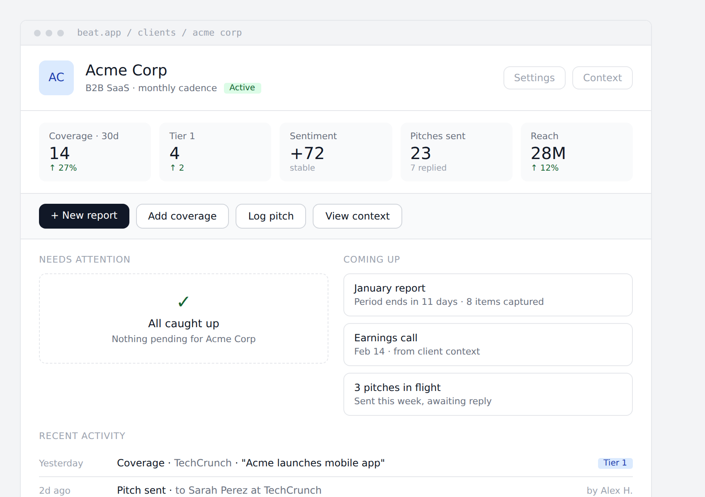
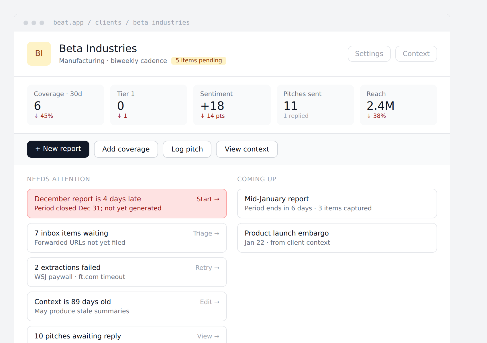
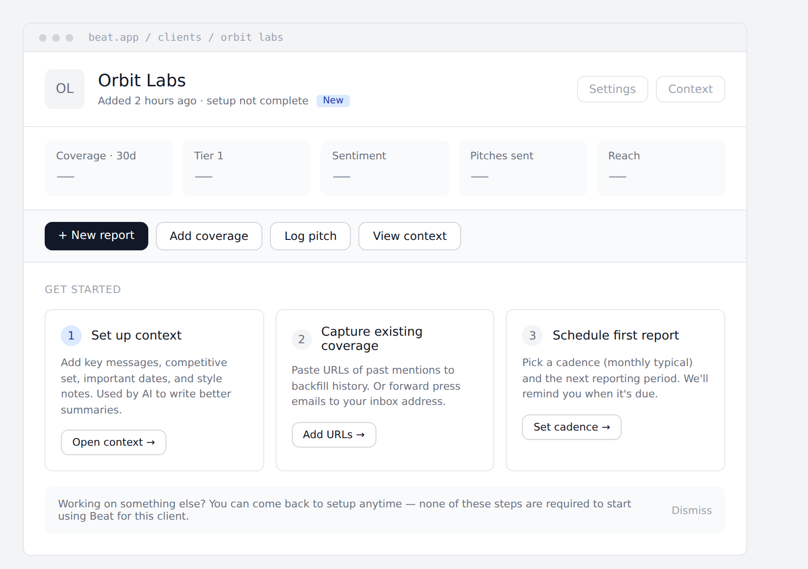
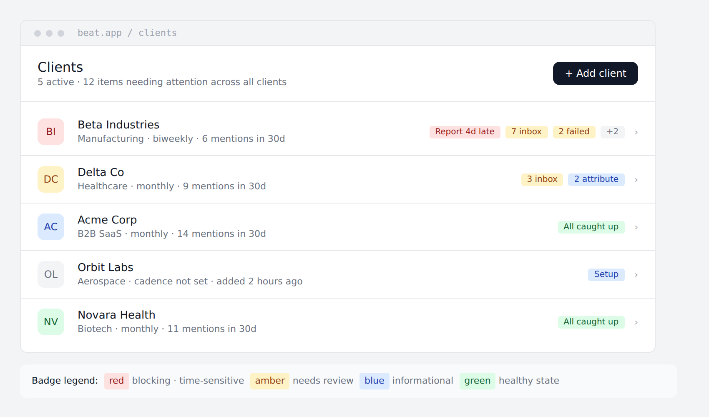

# 16 — Client dashboard and workspace badges (Phase 1)

The page that loads when a user clicks a client row is one of the most-visited surfaces in Beat. It needs to function as an **operations cockpit**: tell the user the state of the relationship, what needs their attention, and what's coming up — all without making them click further.

The same alert signals power **badges on the workspace client list**, so a user can triage the entire firm at a glance before clicking into any client.

This is a Phase 1 deliverable. It depends on:
- `activity_events` (per `docs/15-additions.md` §15.2) — the timeline.
- `client_context` (per `docs/15-additions.md` §15.1) — context-stale alerts and important dates.
- The core report, coverage, and inbox tables from `docs/03-data-model.md`.

## Wireframes

The dashboard has three primary states. The fourth wireframe shows the client list with badges.

### Healthy state

The case where there's no pending work. Empty-state for the attention column shows confirmation, not a void.



### Attention state

The case where multiple things are pending. The dashboard surfaces them ranked by severity (red → amber). Each card has a one-line description and a one-click action.



### New-client state

The case where the client has just been created and has no history. Stats are dashed; the right column becomes a 3-step setup checklist. Dismissible — "I'll do it later" is a valid path.



### Workspace client list with badges

The same alerts that appear on the dashboard are surfaced as compact badges on each client row. Sorted by alert severity descending so the most-broken clients float to the top.



## Information architecture

Every element on the dashboard either **informs** or **links to a focused action**. Nothing on the dashboard is itself an editable form. Edits happen on dedicated surfaces.

| Section | Purpose | Source data |
|---|---|---|
| Header strip | Identity, status pill, quick actions | `clients`, `client_alerts` (count) |
| Stats row | Five 30-day metrics with 30-day-vs-prior-30-day deltas | `coverage_items`, `pitches`, `outlets` |
| Quick actions bar | Primary actions for this client | n/a — links only |
| Needs attention column | Ranked alerts requiring user action | computed alert set (see below) |
| Coming up column | Forward-looking items | upcoming reports, dates from `client_context.important_dates`, in-flight pitches |
| Recent activity | Unified timeline of last 14 days | `activity_events` filtered by client_id |

## Alert types (canonical list)

These alerts power both the dashboard "Needs attention" column and the workspace list badges. Each alert is independently computed; a single client may have many at once.

| Alert ID | Severity | Trigger | Badge label | Dashboard card title |
|---|---|---|---|---|
| `report.overdue` | red | Cadence-derived expected report period closed > 1 day ago, no report generated | `Report Nd late` | `December report is N days late` |
| `extraction.failed` | amber | Coverage items in `failed` status, count ≥ 1 | `N failed` | `N extractions failed` |
| `inbox.pending` | amber | Inbox items for this client unfiled > 5 days | `N inbox` | `N inbox items waiting` |
| `pitch.awaiting_reply` | amber | Pitches sent > 7 days ago, recipient status still `sent` | `N awaiting` | `N pitches awaiting reply` |
| `attribution.suggested` | blue | Coverage items with `pitch_coverage_attributions.confidence='suggested'` | `N attribute` | `N pitches → coverage matches` |
| `context.stale` | amber | `client_context.updated_at` more than 60 days ago | `Context stale` | `Context is N days old` |
| `report.unpublished` | blue | Phase 2: ready report not yet published to portal | `Unpublished` | `December report ready, not published` |
| `client.setup_incomplete` | blue | New client; no context set AND no coverage tracked AND no cadence configured | `Setup` | (replaces dashboard with setup checklist) |
| `client.healthy` | green | None of the above apply | `All caught up` | (renders empty state) |

### Why each alert lands at this severity

- **Red** is reserved for time-sensitive blocking work — currently only overdue reports. The discipline matters: if everything is red, nothing is red. Resist the urge to make extraction failures red just because they feel urgent.
- **Amber** is for things needing human review but not blocking client deliverables. Most alerts live here.
- **Blue** is informational — the user might want to act, but inaction has no immediate consequence.
- **Green** is the explicit "no alerts" state. Surfacing it positively (rather than just having no badges) makes the list scannable.

### Alert thresholds (defaults)

```
INBOX_STALE_DAYS = 5
PITCH_AWAITING_REPLY_DAYS = 7
CONTEXT_STALE_DAYS = 60
REPORT_OVERDUE_GRACE_DAYS = 1   # report period closed + this many days
```

These should be settable per-workspace in Phase 2 (`workspaces.alert_thresholds JSONB`); hardcoded constants in Phase 1.

## Severity scoring (for sorting and aggregate counts)

Each alert contributes a numeric severity score used for two things: ordering badges within a client's row, and ordering clients within the workspace list.

```
red    = 100 per alert
amber  = 10 per alert
blue   = 1 per alert
green  = 0
```

The workspace list sorts clients by `SUM(severity)` descending. Two clients with the same total preserve insertion order (most recently active first).

The header line "12 items needing attention across all clients" counts every red + amber + blue alert across all the workspace's clients. Green alerts don't count.

## Data model

### `client_alerts` — materialized view

We don't compute alerts at request time on every page load — that's expensive and inconsistent. We compute and cache:

```sql
CREATE TABLE client_alerts (
    id              UUID PRIMARY KEY DEFAULT gen_random_uuid(),
    client_id       UUID NOT NULL REFERENCES clients(id) ON DELETE CASCADE,
    workspace_id    UUID NOT NULL REFERENCES workspaces(id) ON DELETE CASCADE,
    alert_type      TEXT NOT NULL,                -- 'report.overdue', 'inbox.pending', etc.
    severity        TEXT NOT NULL CHECK (severity IN ('red','amber','blue','green')),
    count           INT NOT NULL DEFAULT 1,        -- e.g. 7 inbox items
    metadata        JSONB NOT NULL DEFAULT '{}'::jsonb,
    -- For UI rendering without re-deriving:
    badge_label     TEXT NOT NULL,
    card_title      TEXT NOT NULL,
    card_subtitle   TEXT,
    card_action_label TEXT,
    card_action_path  TEXT,                        -- relative URL for the click-through
    computed_at     TIMESTAMPTZ NOT NULL DEFAULT now(),
    UNIQUE (client_id, alert_type)
);

CREATE INDEX idx_client_alerts_workspace ON client_alerts(workspace_id);
CREATE INDEX idx_client_alerts_client ON client_alerts(client_id);
```

One row per active alert per client. Computed by a background job (see Refresh strategy below). The `green` row appears for a client when no other rows exist — it's an explicit "no alerts" marker rather than an absence-of-rows.

### Refresh strategy

Three triggers for recomputation:

1. **Event-driven (preferred).** Specific `activity_events` invalidate specific alerts:
   - `report.generated` → recompute `report.overdue` for that client
   - `coverage.extracted` / `coverage.failed` → recompute `extraction.failed`
   - `inbox.created` / `inbox.assigned` / `inbox.dismissed` → recompute `inbox.pending`
   - `pitch.sent` / `pitch.replied` (Phase 3) → recompute `pitch.awaiting_reply`
   - `client.context_updated` → recompute `context.stale`
   - `client.created` → compute initial alert set
2. **Scheduled.** A `@Scheduled` job runs every 30 minutes to recompute time-based alerts (`report.overdue`, `inbox.pending`, `pitch.awaiting_reply`, `context.stale`) for all clients. Necessary because nothing happens to trigger time passing.
3. **On-demand.** `POST /v1/clients/:id/alerts/refresh` for manual re-trigger from the UI (rarely needed; useful in support).

The job is idempotent and runs in seconds — it scans active clients and upserts the alerts table.

### What's NOT in the table

- **Historical alerts.** Once an alert is resolved, the row is deleted, not retained. History lives in `activity_events` (e.g., the `report.generated` event tells you when an overdue alert was resolved). Don't bloat `client_alerts` with closure history.
- **Per-user dismissals.** All workspace members see the same alerts. Member A can't hide alerts from member B.

## API surface

### `GET /v1/clients/:id/dashboard`

Returns everything the dashboard needs in one round trip — header, stats, alerts, coming up, and a slice of recent activity.

```json
{
  "client": { "id": "...", "name": "Beta Industries", "logo_url": "...", "industry": "Manufacturing", "default_cadence": "biweekly" },
  "stats_30d": {
    "coverage_count": { "value": 6, "delta_pct": -45, "delta_label": "↓ 45%" },
    "tier_1_count":   { "value": 0, "delta": -1, "delta_label": "↓ 1" },
    "sentiment":      { "value": 18, "delta_pts": -14, "delta_label": "↓ 14 pts" },
    "pitches_sent":   { "value": 11, "replied_count": 1, "delta_label": "1 replied" },
    "estimated_reach": { "value": 2400000, "delta_pct": -38, "delta_label": "↓ 38%" }
  },
  "alerts": [
    {
      "alert_type": "report.overdue",
      "severity": "red",
      "count": 1,
      "badge_label": "Report 4d late",
      "card_title": "December report is 4 days late",
      "card_subtitle": "Period closed Dec 31; not yet generated",
      "card_action_label": "Start →",
      "card_action_path": "/clients/abc.../reports/new?period=2025-12"
    },
    ...
  ],
  "coming_up": [
    { "kind": "report_due", "title": "Mid-January report", "subtitle": "Period ends in 6 days · 3 items captured", "path": "..." },
    { "kind": "important_date", "title": "Product launch embargo", "subtitle": "Jan 22 · from client context", "path": "..." }
  ],
  "recent_activity": [
    {
      "occurred_at": "2026-01-15T10:30:00Z",
      "kind": "extraction.failed",
      "label": "Extraction failed",
      "detail": "wsj.com/articles/...",
      "tag": { "label": "Failed", "tone": "danger" },
      "actor_label": null
    },
    ...
  ]
}
```

The frontend renders strictly from this payload — no second round trip for the alerts column or activity timeline.

Latency target: P95 < 250ms. Achievable because everything is already pre-computed (`client_alerts` for alerts, `client_metrics_monthly` from `docs/11-phase-2-features.md` §11.5 for stats — *for Phase 1 we compute stats on-the-fly from `coverage_items` + `pitches`; Phase 2 promotes them to the materialized table*).

### `GET /v1/clients` — augmented

The existing list endpoint from `docs/04-api-surface.md` is augmented with the per-client alert summary used to render badges:

```json
{
  "items": [
    {
      "id": "...",
      "name": "Beta Industries",
      "logo_url": "...",
      "industry": "Manufacturing",
      "default_cadence": "biweekly",
      "coverage_30d": 6,
      "alerts_summary": {
        "total_score": 130,
        "by_severity": { "red": 1, "amber": 3, "blue": 0 },
        "top_badges": [
          { "alert_type": "report.overdue", "severity": "red", "label": "Report 4d late" },
          { "alert_type": "inbox.pending", "severity": "amber", "label": "7 inbox" },
          { "alert_type": "extraction.failed", "severity": "amber", "label": "2 failed" }
        ],
        "overflow_count": 2
      }
    },
    ...
  ],
  "workspace_summary": {
    "total_clients": 5,
    "total_attention_items": 12,
    "by_severity": { "red": 1, "amber": 6, "blue": 5 }
  },
  "next_cursor": null
}
```

Sorted server-side by `alerts_summary.total_score DESC, last_active_at DESC`. The `top_badges` array is capped at 3; anything beyond becomes `overflow_count`.

### `POST /v1/clients/:id/alerts/refresh`

Manually triggers recomputation. Returns the fresh alert set. Rate-limited (10/minute per user).

### `GET /v1/clients/:id/activity?since=…&until=…&limit=…&kind=…`

Paginated activity feed. Supports `kind` filter (e.g. only `coverage.*`), date range, cursor pagination. Drives the "Recent activity" section when the user wants to see more than the dashboard's default slice.

## Computing the stats row

Five tiles, all 30-day rolling. The "delta" for each compares to the prior 30-day window:

| Tile | Computation |
|---|---|
| Coverage · 30d | `COUNT(coverage_items)` where `publish_date >= now()-30d` |
| Tier 1 | Same, filtered to `tier_at_extraction = 1` |
| Sentiment | Average of (positive=+1, neutral=0, negative=-1, mixed=0), times 100, rounded |
| Pitches sent | `COUNT(pitches)` where `sent_at >= now()-30d` (Phase 3+); 0 in Phase 1 with the field hidden |
| Reach | `SUM(estimated_reach)` over the 30-day coverage |

Delta thresholds for color: ≥ 5% positive change → green up arrow; ≤ -5% → red down arrow; otherwise gray "stable" label. The 5% deadband prevents noise on small samples.

Phase 1 computes these on-the-fly per request. Phase 2 promotes to the materialized `client_metrics_monthly` table (per `docs/11-phase-2-features.md` §11.5) and reads from there.

## "Coming up" sources

A unified, ranked list of forward-looking items. Sources:

1. **Next reporting period.** Derived from `clients.default_cadence` + most recent report. "January report — period ends in N days, M items captured."
2. **Important dates from client context.** `client_context.important_dates` is parsed for date references; future-dated items appear here.
3. **In-flight pitches** (Phase 3+). Pitches sent < 7 days ago, no reply yet — surfaced as "N pitches in flight."
4. **Scheduled monitoring searches** (Phase 4). Active searches for this client.

Capped at 5 items. Sorted by date ascending (soonest first).

## Recent activity feed

Pulls from `activity_events` filtered by `target_id = :client_id OR (target_type='report' AND target.client_id = :client_id) OR ...`. The full filter logic lives in a query helper because it spans tables; cache the result for 60 seconds.

Default limit on the dashboard: 8 most recent. "View all activity →" link expands to the full filtered surface (`/clients/:id/activity`).

Each event renders with a date label (relative for < 7 days, absolute beyond), a primary text, optional secondary "muted" detail, and an optional badge. The presentation rules live in a dedicated formatter:

```java
public class ActivityEventFormatter {
    public ActivityRow format(ActivityEvent e) { ... }
}
```

This is shared between dashboard recent activity, full activity page, and the weekly digest (`docs/15-additions.md` §15.3) — keep it DRY.

## UI surface — frontend specifics

### Layout

Single-column responsive layout. Desktop default 980px content width. The two-column "Needs attention / Coming up" stacks on mobile, with attention always first.

### State machine

The dashboard renders one of four states based on the alert set:

1. **`new`** — `client.setup_incomplete` is the only alert. Show the 3-step setup checklist (right column replaces "Coming up"). Stats render as `—`. Recent activity hidden.
2. **`attention`** — at least one red, amber, or non-setup blue alert. Standard layout; alert cards in priority order.
3. **`healthy`** — only `client.healthy` alert. Empty-state card in attention column. Standard layout otherwise.
4. **`paused`** — Phase 4: client marked inactive. Greyed-out chrome, banner explaining state.

State is determined client-side from the dashboard payload — no server state machine.

### Alert card priority order

Within "Needs attention", cards render in this order:

1. All `red` alerts, by recency desc.
2. All `amber` alerts, by recency desc.
3. All `blue` alerts (excluding setup), by recency desc.

The `client.setup_incomplete` and `client.healthy` alerts are special: they replace the entire column rather than appearing as cards.

### Quick actions bar

Four buttons, always visible:

- **+ New report** — primary. Goes to report builder with the client preselected.
- **Add coverage** — opens a modal with URL paste + immediate extraction.
- **Log pitch** (Phase 3) — opens pitch composer. Hidden in Phase 1.
- **View context** — opens `/clients/:id/context`.

Don't add more buttons. The discipline of four max keeps the bar scannable; everything else lives one click deeper.

### Badges in the workspace list

Layout: 3 badges max + "+N" overflow. Each badge is a small pill (10px font, padding 2px 7px, radius 3px). Color follows the severity → color mapping below.

| Severity | Background | Foreground |
|---|---|---|
| Red | `#FEE2E2` | `#991B1B` (font-weight 500) |
| Amber | `#FEF3C7` | `#92400E` |
| Blue | `var(--color-background-info)` | `var(--color-text-info)` |
| Green | `#DCFCE7` | `#166534` |
| Overflow | `var(--color-background-tertiary)` | `var(--color-text-secondary)` |

Tooltip on hover: full alert label + click-through path.

### Header line

Workspace list shows `"N active · M items needing attention across all clients"`. M is the count of red + amber + blue alerts across the workspace. When M is 0, the line reads `"N active · all caught up"`.

## Phase boundaries

This Phase 1 spec deliberately defers some surfaces:

- **Per-user assignment of clients.** The "my clients" filter is Phase 2 — needs the team-membership model from `docs/11-phase-2-features.md` §11.2.
- **Customizable alert thresholds.** Per-workspace overrides land in Phase 2 alongside the team-settings UI.
- **Per-user alert dismissal.** Not in v1. Alerts are workspace-scoped; everyone sees them.
- **Compact pitch / monitoring rows in alerts.** Phase 3 / Phase 4. The data isn't there in Phase 1.
- **Sentiment / reach trend sparklines on the stats row.** Phase 2 — simple deltas only in Phase 1.

## Build-plan slot-ins

Updates to `docs/08-build-plan.md`:

### Week 2 additions

After the existing `clients` CRUD work:

> - **Workspace client list with badges (per `docs/16-client-dashboard.md`)**: `GET /v1/clients` returns per-client `alerts_summary` + workspace summary. Frontend renders badges with severity colors, sorts by `total_score DESC`.

(In Phase 1 the alerts table doesn't exist yet — Week 2 returns a stub `alerts_summary` with all-zero counts. Real alerts land in Week 8.)

### Week 5 additions

After report-builder UI:

> - **Client dashboard scaffolding**: route `/clients/:id`, header strip, stats row (computed on-the-fly), recent activity from `activity_events`. Two-column layout. No alerts data yet — "Needs attention" shows a placeholder.

### Week 8 additions (NEW WEEK content)

This is a meaningful chunk that should slot into week 8 alongside billing — billing and alerts both involve scheduled jobs and are independent enough to parallelize:

> - **Alert engine and `client_alerts` table (per `docs/16-client-dashboard.md`)**:
>   - Migration: `client_alerts` table.
>   - Six alert computations: `report.overdue`, `extraction.failed`, `inbox.pending`, `context.stale`, `client.setup_incomplete`, `client.healthy`. (Pitch- and attribution-related alerts deferred to Phase 3.)
>   - Event-driven invalidation hooks on the corresponding `activity_events` writes.
>   - 30-minute scheduled job for time-based alerts.
>   - `GET /v1/clients/:id/dashboard` endpoint returning the unified payload.
>   - Frontend "Needs attention" column populated; client-list badges populated.

### Week 9 additions

In addition to existing scope:

> - **Polish for the dashboard states**: empty states (healthy, no recent activity, no upcoming items), loading skeletons, dismiss action on the new-client setup checklist (`POST /v1/clients/:id/setup-checklist/dismiss`), tooltips on badges.

## Acceptance criteria

- A user lands on `/clients/:id` and the dashboard renders fully (incl. alerts) within 250ms P95.
- The workspace `/clients` list is sorted with the most-broken client at the top, the healthiest at the bottom.
- Each alert card has exactly one click-through that takes the user to the right surface to act on it.
- The "12 items needing attention" header count exactly matches the sum of badges across all client rows on the same page.
- Resolving an alert (e.g., generating an overdue report) removes the corresponding card from the dashboard and the badge from the list within 60 seconds (event-driven invalidation).
- A new client with no setup history shows the 3-step checklist; dismissing it persists across reloads (per-workspace, in `clients.setup_dismissed_at`).
- Healthy state renders the green "All caught up" empty-state card — never just blank space.
- All four wireframe states render correctly with realistic test data.

## Risks & open questions

1. **Alert overload.** A client with 8 alerts becomes a wall of cards. Mitigation: stack-rank by severity, paginate the column at 6 visible + "show N more." Watch in dogfood.
2. **Recent activity privacy across team members.** A `viewer`-role member sees activity from `owner` and `member` actions. Acceptable in Phase 1 (everyone in a workspace already has access to client data); revisit if RBAC tightens.
3. **The "stale context" definition.** 60 days is arbitrary. Watch how often customers update context post-first-month; tune the threshold based on real behavior in dogfood.
4. **Sort stability.** Two clients with the same severity score and same `last_active_at` could swap positions on every reload. Add `client.id` as a final tiebreaker for deterministic sort order.
5. **Computing "important dates" from free-text context.** `client_context.important_dates` is a TEXT field. Extracting structured future-dated entries means parsing it on save. Approach: simple regex for ISO-like dates and "Month DD" patterns; LLM extraction is overkill at this stage. Promote to LLM-assisted parsing if the regex misses too much.

## Cross-references

- `docs/03-data-model.md` — base tables for clients, reports, coverage_items
- `docs/04-api-surface.md` — `GET /v1/clients` to be augmented per this doc
- `docs/15-additions.md` — `activity_events` (powers timeline) and `client_context` (powers stale-context alert and important dates)
- `docs/11-phase-2-features.md` §11.5 — `client_metrics_monthly` (Phase 2 promotion of stats row)
- `docs/14-multi-tenancy.md` — alerts and badges are workspace-scoped; pre-flight checklist applies to `client_alerts` table
